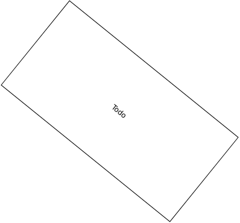

# Elevator Airlock

Elevator Airlock that supports
 - Max 2 levels
 - Vaccuum to Atmo, no Atmo to Atmo
 - Automatic detection of inside pressure

 Needs the following devices:
 - Elevator
 - 2x Gas Sensor
 - 2x Door
 - Active vent

 Usage:
 - Use elevator buttons as normal, pressurization follows automatically
 - if door in front of elevator is closed, press button on door to call elevator

 See following Schema for installation.
 You need to define in the first two lines of the code on what levels your inside and your outside are.

 